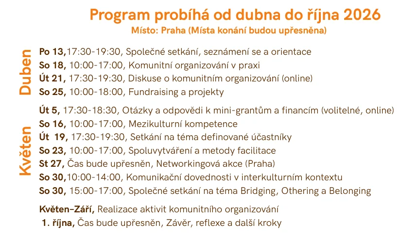

**Praha | duben – říjen 2026**

Jste aktivní v občanských nebo veřejně prospěšných iniciativách v Praze? Pořádáte akce, prosazujete změny, mobilizujete sousedy nebo vytváříte prostor pro témata, která jsou pro společnost důležitá?

Pokud chcete posílit dopad svých aktivit, rozvinout své dovednosti a propojit se s dalšími aktivními lidmi v Praze, tento program je přesně pro vás. Zveme vás do našeho vzdělávacího programu — 40hodinového tréninku pro všechny, kteří chtějí prohloubit svou praxi jako komunitní organizátoři.

Více o programu si přečtěte v [**Open callu**](https://migact.net/news/open-call-for-participants-community-organizers-training-programme-2026/oc-organizatori-cz-1.pdf) a [\*\*Přehledů workshopů](Workshops_organizeri_CZ.pdf).\*\*

<!--more-->

### **Jak se přihlásit?**

- \*\*Vyplnit registrační formulář: [Přihláška](https://forms.gle/ybST94zbynNJsbZ27)
- **Termín programu:** duben – říjen 2026.
- **Uzávěrka přihlášek:** 23. března 2026.
- **Kapacita:** Max. 12 účastníků (přihlášky posuzujeme průběžně, doporučujeme neotálet).

**Máte nějaké dotazy?** Napište nám na adresu: [nastassia@migact.net](mailto:nastassia@migact.net)

Konečná rozhodnutí budou oznámena po pohovorech, nejpozději **do 31. března 2026**.

**MigAct si vyhrazuje právo na změny v programu.**

Tento projekt byl podpořen Evropskou filantropickou iniciativou pro migraci (EPIM), společnou iniciativou Sítě evropských nadací (NEF). Mini granty jsou podporovány Českou spořitelnou, a.s.
