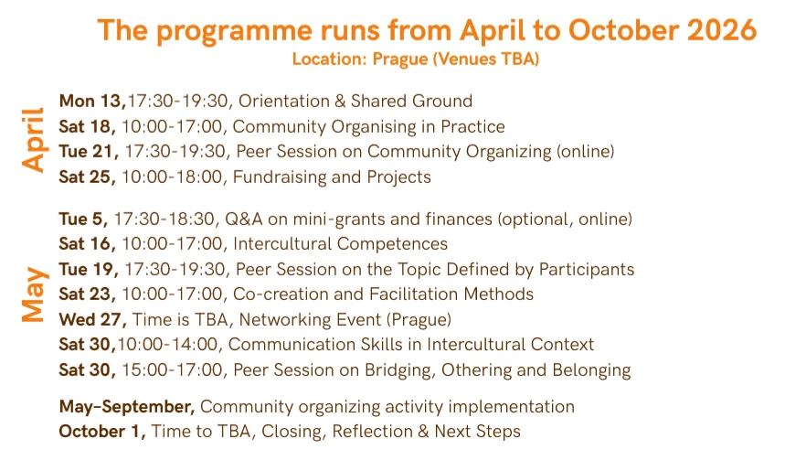

**Prague | April – October 2026**

Are you passionate about civic life in Prague? Whether you are mobilizing neighbors, advocating for local change, or creating spaces for public engagement, we want to help you grow and connect with other like-minded people.

Join our **Community Organizers Training**—a 40-hour capacity-building journey designed for those ready to deepen their practice and amplify their impact.

Read more about the program in [**Open call**](https://migact.net/news/open-call-for-participants-community-organizers-training-programme-2026/oc-organizers-en.pdf) and [**Workshops overview**](Workshops_organizers_EN.pdf)

<!--more-->

### How to Apply

1. **Submit the form:**🔗 [**Apply Here**](https://forms.gle/ybST94zbynNJsbZ27)
2. **Short Interview:** Selected applicants will be invited for a brief chat.

- **Deadline:** March 23, 2026.
- **Capacity:** Limited to 12 participants. We review applications on a rolling basis, so apply early!

**Have any questions?** Email us at: [**nastassia@migact.net**](mailto:nastassia@migact.net).

Final decisions will be communicated after the interviews, no later than **March 31, 2026**.

**MigAct reserves the right to make changes to the program if necessary.**

This Project has been supported by the European Philanthropic Initiative for Migration (EPIM), a collaborative initiative of the Network of European Foundations (NEF). The mini grants are supported by Česka spořitelna a.s.
