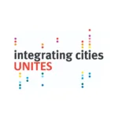

Pod vedením [Eurocities](https://eurocities.eu/latest/cities-rally-for-integration/), projekt UNITES (UrbaN InTEgration Strategies through co-design) školí a provází orgány místní samosprávy při spoluvytváření strategií integrace s ostatními zainteresovanými aktéry, včetně migrantů.

MigAct je součástí projektu UNITES od jeho počátku. Ve spolupráci s pražským magistrátem jsme připravily a uskutečnily sérii participativních workshopů, každý zaměřený na posílení spolupráce mezi pražským magistrátem a obyvateli s migračním původem.

Mezinárodní konference [Cesta k rovnosti: podpora občanské angažovanosti v interkulturním prostředí](https://youtu.be/0XqstWapS5M), která se konala 21. 09. 2023 v Praze, byla spolufinancována v rámci projektu UNITES. Součástí byla panelová diskuse _Zapojení migrantů do místních komunit a spoluvytváření strategií integrace – perspektivy evropských partnerů v rámci projektu UNITES.

