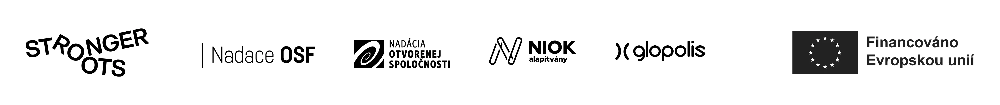

V rámci projektu připravíme a zrealizujeme crowdfundingovou kampaň, která se zaměří na sběr prostředků na školení a posílení kapacit místních komunitních lídrů - lidí, kteří jsou aktivní v sousedských/místních aktivitách na území hl. města Prahy. Zaměříme se primárně na aktivní jednotlivce, kteří mají migrační původ. Vybraní účastníci projektu následně absolvují školení zaměřené na posílení jejích občanských kompetencí a uspořádají místní setkání na vybrané téma ve svých lokalitách.

Projekt byl podpořen Nadací OSF z programu Stronger Roots, který je financován Evropskou unií z programu Občané, rovnost, práva a hodnoty (CERV). Program Stronger Roots posiluje odolnost a stabilitu neziskových organizací a přispívá k jejich většímu propojení s veřejností.

Vyjádřené názory a stanoviska jsou však pouze názory a stanoviska autora (autorů) a nemusí nutně odrážet názory a stanoviska Evropské unie nebo Nadace OSF. Evropská unie ani Nadace OSF za ně nenesou odpovědnost.

